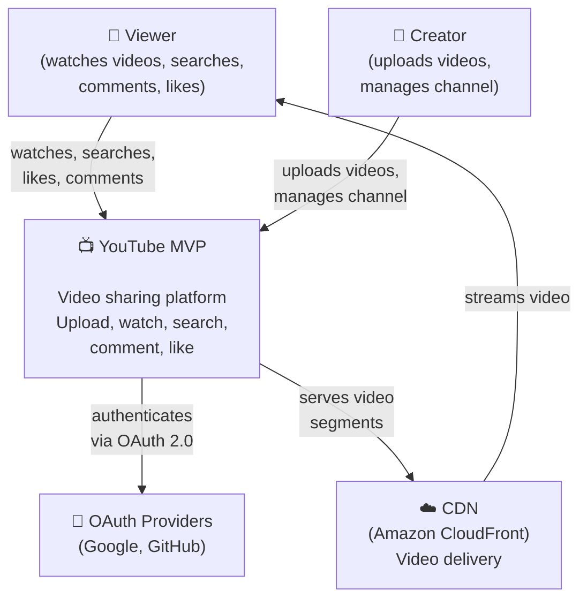
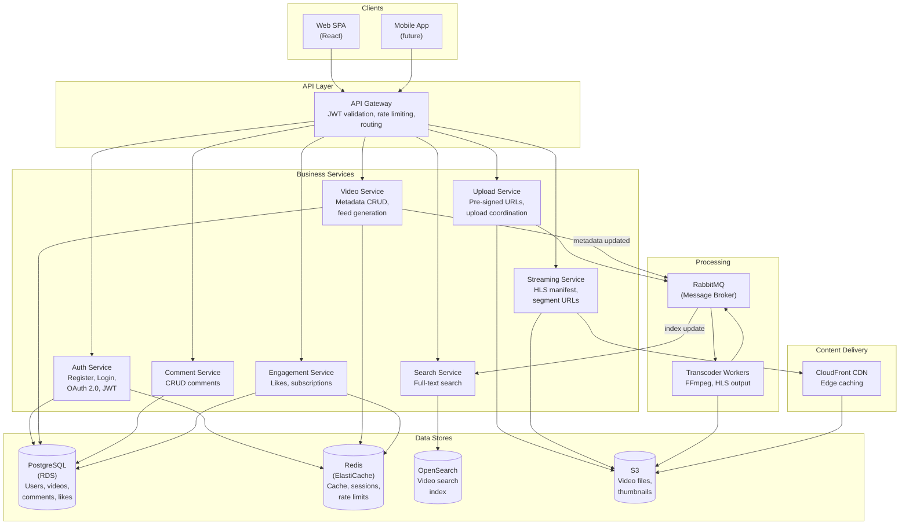
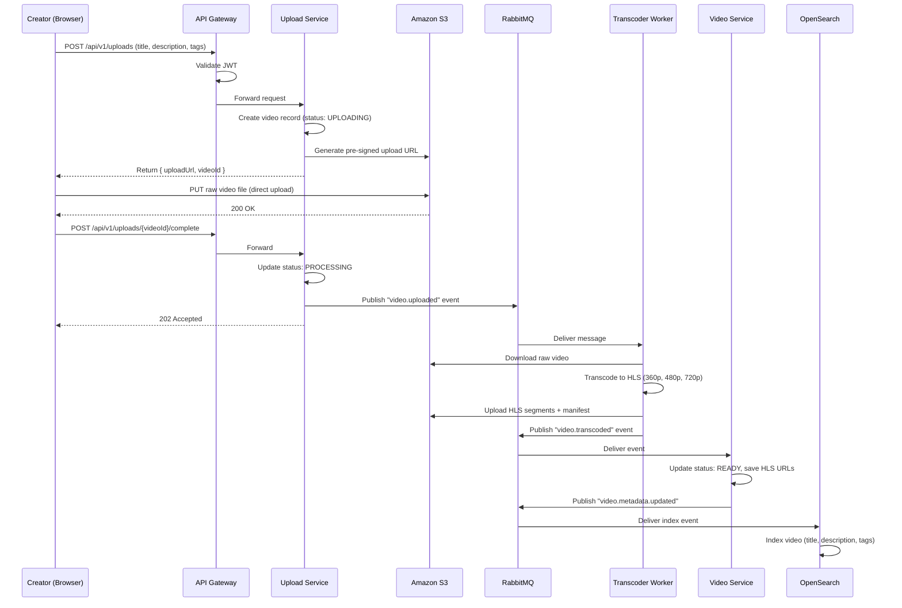
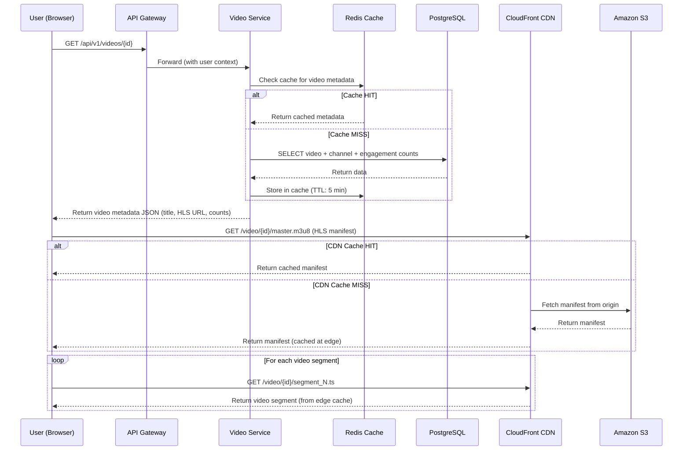
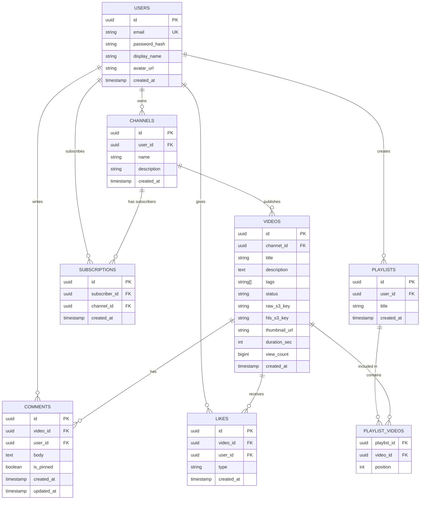

# Task 2 — Non-Functional Requirements, ASRs, and Architecture Diagrams

**Project:** YouTube MVP
**Authors:** Mike Ivanov
**Date:** March 2026

---

## Table of Contents

1. [Quality Attribute Scenarios (NFRs)](#1-quality-attribute-scenarios-nfrs)
2. [Business Constraints](#2-business-constraints)
3. [Architecture-Significant Requirements (ASRs)](#3-architecture-significant-requirements-asrs)
4. [C4 Model — Level 1 (System Context)](#4-c4-model--level-1-system-context)
5. [C4 Model — Level 2 (Container Diagram)](#5-c4-model--level-2-container-diagram)
6. [Sequence Diagram: Video Upload & Processing](#6-sequence-diagram-video-upload--processing)
7. [Sequence Diagram: Video Playback](#7-sequence-diagram-video-playback)
8. [ERD — Core Data Model](#8-erd--core-data-model)

---

## 1. Quality Attribute Scenarios (NFRs)

### QAS-1: Performance — Video Playback Start Time

| Element | Description |
|---------|-------------|
| **Source** | User (viewer) |
| **Stimulus** | Clicks play on a video |
| **Artifact** | CDN + Streaming Service |
| **Environment** | Normal operation, 15K concurrent users |
| **Response** | First video frame begins rendering |
| **Response Measure** | ≤ 2 seconds (p95) from click to first frame |

**Rationale:** Slow playback start causes users to abandon. Industry standard for video platforms is under 2 seconds for first frame. CDN edge caching and HLS pre-loading are key enablers.

---

### QAS-2: Availability — Core Playback Path

| Element | Description |
|---------|-------------|
| **Source** | Any user |
| **Stimulus** | Requests video playback or feed at any time |
| **Artifact** | CDN, S3, Video Service, API Gateway |
| **Environment** | Normal + single AZ failure |
| **Response** | System continues serving video content |
| **Response Measure** | 99.9% uptime (~8.7 hours downtime/year) |

**Rationale:** If users can't watch videos, the platform has no value. This is the one path that must survive infrastructure failures. Achieved via Multi-AZ deployments and CDN redundancy.

---

### QAS-3: Scalability — Handling Traffic Growth

| Element | Description |
|---------|-------------|
| **Source** | Growing user base |
| **Stimulus** | MAU grows from 50K to 500K over 12 months |
| **Artifact** | All backend services, database, cache |
| **Environment** | Normal operation |
| **Response** | System handles 10× traffic without architecture change |
| **Response Measure** | p99 API latency stays ≤ 500ms; no service rewrites needed |

**Rationale:** An MVP that succeeds will grow. The architecture must scale horizontally (more container instances, read replicas, cache sharding) without redesigning the system.

---

### QAS-4: Security — Authentication and Data Protection

| Element | Description |
|---------|-------------|
| **Source** | Malicious actor |
| **Stimulus** | Attempts brute-force login, JWT tampering, or unauthorized access |
| **Artifact** | Auth Service, API Gateway |
| **Environment** | Normal operation |
| **Response** | Attack is blocked; no unauthorized access granted |
| **Response Measure** | Login attempts rate-limited (5/min/IP); JWT signed with RS256; zero unauthorized data access |

**Rationale:** User accounts and content must be protected. Compromised accounts means creators lose control of their content and users lose trust.

---

### QAS-5: Reliability — Video Processing Pipeline

| Element | Description |
|---------|-------------|
| **Source** | Creator |
| **Stimulus** | Uploads a video file |
| **Artifact** | Upload Service, RabbitMQ, Transcoder |
| **Environment** | Normal operation, including transient failures |
| **Response** | Video is transcoded and made available |
| **Response Measure** | 99.5% of uploads processed successfully within 10 minutes; zero data loss on transient failures |

**Rationale:** Failed uploads frustrate creators. The pipeline must be durable — if a transcoder crashes mid-job, the message stays in the queue and another worker picks it up.

---

### QAS-6: Modifiability — Adding New Features

| Element | Description |
|---------|-------------|
| **Source** | Development team (2–4 engineers) |
| **Stimulus** | Need to add a new feature (e.g., notifications, recommendations) |
| **Artifact** | Microservice architecture |
| **Environment** | Development and deployment |
| **Response** | New feature added as independent service without modifying existing services |
| **Response Measure** | New service deployed independently; zero downtime for existing services; ≤ 2 weeks to add a standard feature |

**Rationale:** MVP will evolve rapidly. Microservice boundaries must be clean enough that adding a notifications service doesn't require touching the video or comment services.

---

## 2. Business Constraints

| Constraint | Impact on Architecture |
|------------|----------------------|
| **Small team (2–4 engineers)** | Favor managed services (RDS, ElastiCache, S3) over self-hosted. Minimize operational overhead. One protocol (REST) everywhere to reduce cognitive load. |
| **Budget: ~$5,000–7,000/month for infrastructure** | Use cost-effective instance types (t4g family). Avoid over-provisioning. CDN costs dominate — limit video quality to 720p for MVP. |
| **Time to market: 3–4 months** | No custom solutions where managed services exist. No premature optimization. Ship working features, optimize later. |
| **Region: EU (GDPR compliance)** | Deploy in Frankfurt (eu-central-1). All user data stays in EU. S3 bucket with EU-only replication. |
| **No DevOps hire initially** | CI/CD must be simple (GitHub Actions). Infrastructure as Code (Terraform) for reproducibility. Logging and monitoring via AWS-managed CloudWatch. |

---

## 3. Architecture-Significant Requirements (ASRs)

From the functional (Task 1) and non-functional requirements above, we identify which are **architecture-significant** — meaning they directly influence the structure of the system.

| # | Requirement | Why Architecture-Significant |
|---|------------|------------------------------|
| **ASR-1** | Video playback ≤ 2s start time (QAS-1) | Requires CDN architecture with edge caching, HLS format decision, and separation of streaming path from API path. Shapes the entire content delivery layer. |
| **ASR-2** | 99.9% availability for playback (QAS-2) | Forces Multi-AZ deployment for all Tier 1 components, minimum 2 instances for critical services, automatic failover for database. Defines infrastructure topology. |
| **ASR-3** | Async video processing pipeline (QAS-5, US-04) | Requires a message broker (RabbitMQ), separate transcoder workers, durable queues. This is not a simple CRUD operation — it introduces an entire async processing layer. |
| **ASR-4** | Separation of read and write paths | System is read-heavy (49 QPS reads vs 1.2 QPS writes). Requires cache layer (Redis), read replicas, CDN — the architecture must be optimized for reads. |
| **ASR-5** | Stateless services for horizontal scaling (QAS-3) | Services must store no local state. All state goes to external stores (PostgreSQL, Redis, S3). This determines how services are designed, deployed, and scaled. |
| **ASR-6** | JWT-based auth for microservices (QAS-4) | Authentication cannot be a bottleneck — every request passes through it. Stateless JWT validation at the gateway (no round-trip to Auth Service) is an architectural pattern that affects all service-to-service communication. |
| **ASR-7** | Independent deployability (QAS-6) | Each service must have its own deployment pipeline, its own database schema, and communicate only through APIs or events. Defines service boundaries and data ownership. |

**Not architecture-significant (examples):**
- Playlist ordering (UI/implementation detail, no structural impact)
- Password minimum length (configuration, not architecture)
- Comment pagination (standard pattern, doesn't affect system structure)

---

## 4. C4 Model — Level 1 (System Context)

Shows the YouTube MVP as a black box and its external actors.

---

## 5. C4 Model — Level 2 (Container Diagram)

Shows the internal containers (services, databases, queues) of the YouTube MVP.

---

## 6. Sequence Diagram: Video Upload & Processing

This is the most complex flow in the system — a multi-step async pipeline that spans several services.

---

## 7. Sequence Diagram: Video Playback

Shows how a video page load works, including CDN cache interaction.

---

## 8. ERD — Core Data Model

### Key Design Decisions

| Decision | Rationale |
|----------|-----------|
| UUID primary keys | Safe for distributed generation, no sequential ID enumeration |
| Separate `CHANNELS` table | A user can have 0 or 1 channel; channel is created on first upload |
| `LIKES` with unique constraint on `(video_id, user_id)` | Enforces one like/dislike per user per video (idempotent) |
| `view_count` on `VIDEOS` table | Denormalized counter; updated via Redis buffering (batch flush every 60s) |
| `status` enum on `VIDEOS` | Tracks async processing pipeline: `UPLOADING → PROCESSING → READY → FAILED` |
| `tags` as PostgreSQL array | Simple for MVP; supports `GIN` index for tag search |
