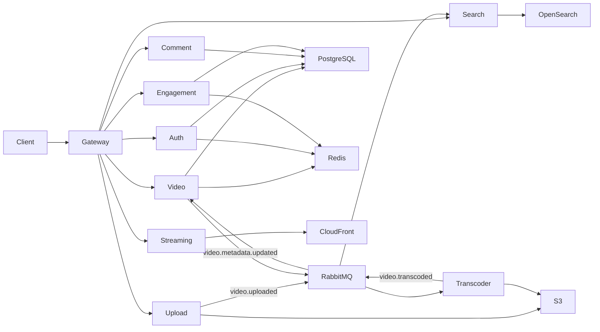
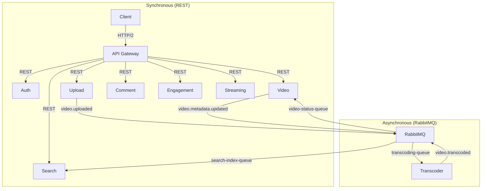
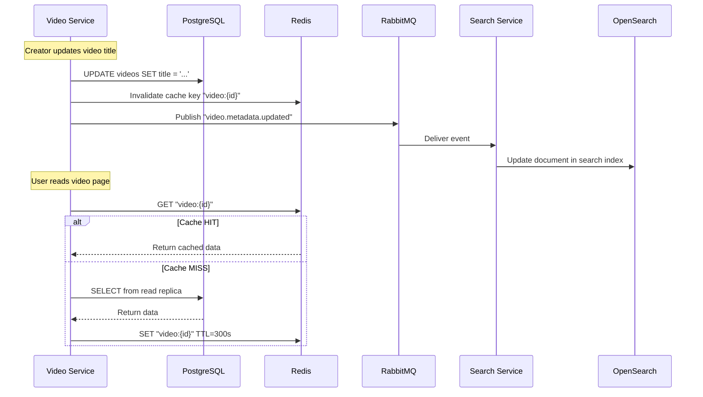
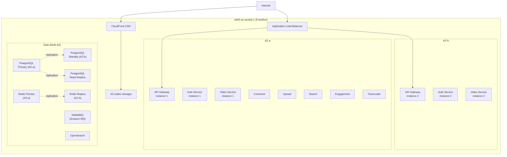

# Task 3 — Microservice Architecture

**Project:** YouTube MVP
**Authors:** Mike Ivanov
**Date:** March 2026

---

## Table of Contents

1. [Service Decomposition](#1-service-decomposition)
2. [Inter-Service Communication](#2-inter-service-communication)
3. [Data Ownership and Synchronization](#3-data-ownership-and-synchronization)
4. [Deployment Architecture](#4-deployment-architecture)
5. [Microservice Patterns Used](#5-microservice-patterns-used)

---

## 1. Service Decomposition

We decompose the system by **business capability** — each service owns one domain and its data.

| Service | Responsibility | Database | Port |
|---------|---------------|----------|------|
| **API Gateway** | Routing, JWT validation, rate limiting | — (stateless) | 8080 |
| **Auth Service** | Registration, login, OAuth 2.0, token management | PostgreSQL (users, roles), Redis (refresh tokens, rate limits) | 8081 |
| **Video Service** | Video metadata CRUD, feed generation, view counting | PostgreSQL (videos, channels), Redis (feed cache) | 8082 |
| **Upload Service** | Pre-signed URL generation, upload coordination | PostgreSQL (upload status) | 8083 |
| **Comment Service** | Create, edit, delete, list comments | PostgreSQL (comments) | 8084 |
| **Engagement Service** | Likes/dislikes, subscriptions | PostgreSQL (likes, subscriptions), Redis (counters) | 8085 |
| **Search Service** | Full-text video search | OpenSearch (search index) | 8086 |
| **Streaming Service** | HLS manifest and segment URL resolution | S3, CloudFront | 8087 |
| **Transcoder Worker** | Video transcoding (raw → HLS) | S3 (read/write), RabbitMQ (consumer) | — |

### Service Dependency Graph



---

## 2. Inter-Service Communication

### Synchronous (REST HTTP/2)

All client-facing requests go through the API Gateway and are routed to the appropriate service via synchronous REST calls. Services do not call each other synchronously — all inter-service data sharing happens through the database or events.

| Caller | Callee | Protocol | Purpose |
|--------|--------|----------|---------|
| Client → Gateway | All services | REST/HTTP2 | All client requests |
| Gateway → Auth Service | Auth Service | REST | `/auth/*` endpoints |
| Gateway → Video Service | Video Service | REST | `/videos/*` endpoints |
| Gateway → Comment Service | Comment Service | REST | `/comments/*` endpoints |
| Gateway → Engagement Service | Engagement Service | REST | `/likes/*`, `/subscriptions/*` |
| Gateway → Search Service | Search Service | REST | `/search/*` |
| Gateway → Upload Service | Upload Service | REST | `/uploads/*` |
| Gateway → Streaming Service | Streaming Service | REST | `/stream/*` |

**Why no service-to-service sync calls:**
- Reduces coupling — services don't need to know each other's APIs.
- Eliminates cascading failures from synchronous chains.
- Simpler debugging — every request has one service handler.

### Asynchronous (RabbitMQ)

Asynchronous communication is used for events that trigger background processing or data synchronization. We chose **RabbitMQ** as the message broker.

| Event | Publisher | Consumer(s) | Queue | Purpose |
|-------|-----------|-------------|-------|---------|
| `video.uploaded` | Upload Service | Transcoder Worker | `transcoding-queue` | Start video transcoding |
| `video.transcoded` | Transcoder Worker | Video Service | `video-status-queue` | Update video status to READY |
| `video.metadata.updated` | Video Service | Search Service | `search-index-queue` | Update OpenSearch index |
| `video.deleted` | Video Service | Search Service, Transcoder | `video-deleted-queue` | Remove from index, clean up S3 |

#### Why RabbitMQ (not Kafka)

| Factor | RabbitMQ | Kafka |
|--------|----------|-------|
| **Use case** | Task queues, work distribution | Event streaming, log aggregation |
| **Our need** | Each message processed once by one worker | Not needed — we don't replay events |
| **Complexity** | Simple broker, easy to operate | Requires ZooKeeper/KRaft, partition management |
| **Message guarantees** | Per-message ack, DLQ, retry | At-least-once with consumer group offsets |
| **Scale** | Sufficient for 250 videos/day (~0.003 msg/s) | Designed for 100K+ msg/s — overkill |
| **AWS managed** | Amazon MQ (RabbitMQ) | Amazon MSK — more expensive, more complex |
| **Team familiarity** | Well-known, simple API | Steeper learning curve |

**Decision:** RabbitMQ via Amazon MQ. Durable queues for reliability. DLQ for failed messages.

### Communication Diagram



---

## 3. Data Ownership and Synchronization

### Database per Service (Logical)

Each service owns its own data. We use a **single PostgreSQL instance** with **separate schemas per service** for the MVP. This gives us logical isolation with minimal operational overhead.

| Service | Schema | Tables |
|---------|--------|--------|
| Auth Service | `auth` | `users`, `refresh_tokens` |
| Video Service | `video` | `videos`, `channels` |
| Comment Service | `comment` | `comments` |
| Engagement Service | `engagement` | `likes`, `subscriptions` |
| Upload Service | `upload` | `upload_jobs` |

**Why separate schemas, not separate databases:**
- One PostgreSQL instance to manage (backups, monitoring, failover) — appropriate for a 2–4 person team.
- Logical isolation — services only access their own schema via separate DB users with schema-level permissions.
- Can split into separate databases later if a service needs independent scaling.

### Data Patterns

| Pattern | Where Used | Description |
|---------|-----------|-------------|
| **Database per Service** (logical) | All services | Each service owns its schema; no cross-schema queries |
| **Event-Driven Sync** | Video → Search | Video metadata changes are published as events; Search Service consumes and updates its OpenSearch index |
| **Cache-Aside** | Video, Engagement | Service checks Redis first; on miss, reads from PostgreSQL and populates cache |
| **CQRS (lightweight)** | Video Service | Reads served from Redis cache + read replica; writes go to primary PostgreSQL |
| **Saga (implicit)** | Upload pipeline | Upload → Transcode → Update status. Each step is independent with compensation on failure (DLQ + manual retry) |

### Data Synchronization Flow



---

## 4. Deployment Architecture

### Technology: AWS ECS Fargate (Containers)

We deploy on **AWS ECS Fargate** — serverless containers. No EC2 instances to manage.

| Component | Why Fargate |
|-----------|------------|
| **No server management** | Team doesn't manage OS patches, capacity, or instance types |
| **Per-service scaling** | Each service scales independently based on CPU/memory |
| **Cost-effective at MVP scale** | Pay per vCPU-second, no idle capacity waste |
| **Simple deployment** | Docker image → ECR → ECS task definition → rolling update |

### Deployment Topology



### CI/CD Pipeline

```
GitHub (push to main)
    → GitHub Actions
        → Run tests
        → Build Docker image
        → Push to Amazon ECR
        → Update ECS task definition
        → Rolling deployment (zero downtime)
```

| Step | Tool | Details |
|------|------|---------|
| Source | GitHub | Monorepo with service folders |
| CI | GitHub Actions | Test → Build → Push per service |
| Container Registry | Amazon ECR | One repository per service |
| Deploy | ECS Rolling Update | Minimum healthy 100%, max 200% — new containers start before old ones stop |
| Infrastructure | Terraform | VPC, ECS clusters, RDS, ElastiCache, S3 defined as code |

---

## 5. Microservice Patterns Used

| Pattern | Implementation | Purpose |
|---------|---------------|---------|
| **API Gateway** | Dedicated Gateway service with JWT validation, rate limiting, routing | Single entry point; cross-cutting concerns in one place |
| **Database per Service** | Separate PostgreSQL schemas per service | Data ownership and independence |
| **Event-Driven** | RabbitMQ for async events | Decoupled inter-service communication |
| **CQRS (lightweight)** | Read from cache/replica, write to primary | Optimize read-heavy workload |
| **Cache-Aside** | Redis cache with TTL | Reduce database load on hot paths |
| **Saga** | Upload → Transcode → Index (choreography-based) | Distributed transaction for video processing |
| **Sidecar** (future) | Envoy proxy for observability | Request tracing, metrics — deferred for MVP |
| **Strangler Fig** (migration path) | Can migrate individual services to gRPC/Aurora | Incremental evolution without rewrite |
| **Dead Letter Queue** | RabbitMQ DLQ for failed messages | Prevent pipeline blockage by poison messages |
| **Health Check** | `/health` and `/ready` endpoints per service | Auto-healing and load balancer integration |
| **Circuit Breaker** | Per-service client with failure threshold | Prevent cascading failures |
