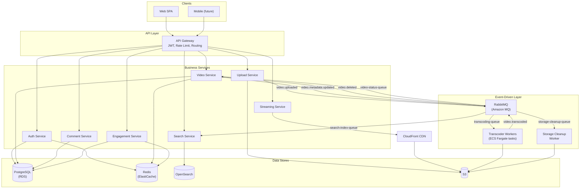
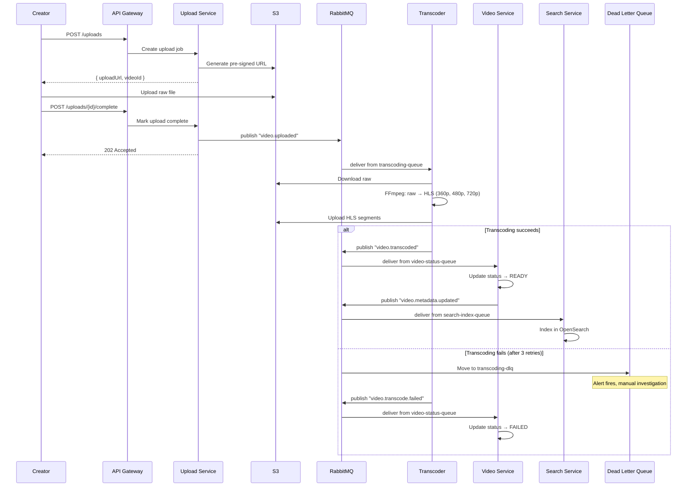
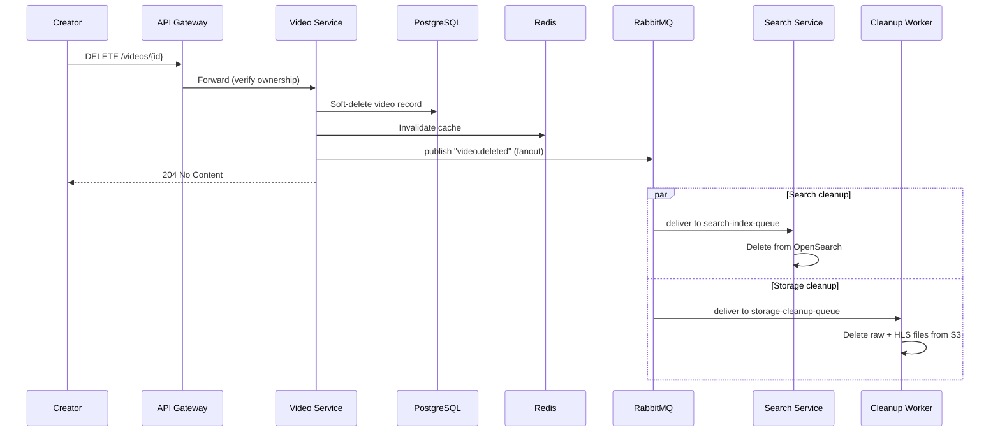
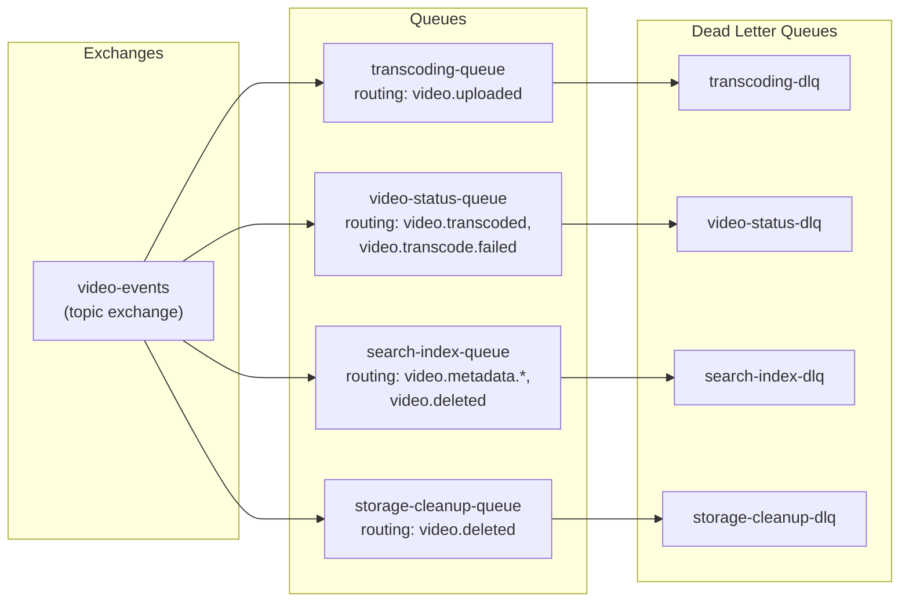

# Task 4 — Event-Driven Architecture

**Project:** YouTube MVP
**Authors:** Mike Ivanov
**Date:** March 2026

---

## Table of Contents

1. [Key Use Cases Requiring EDA](#1-key-use-cases-requiring-eda)
2. [Event-Driven Patterns Used](#2-event-driven-patterns-used)
3. [Event Catalog](#3-event-catalog)
4. [Tech Stack for EDA](#4-tech-stack-for-eda)
5. [Architecture Diagrams](#5-architecture-diagrams)

---

## 1. Key Use Cases Requiring Event-Driven Architecture

Not every interaction in the system needs events. We use EDA where:
- The operation is **long-running** and shouldn't block the user.
- Multiple services need to **react independently** to something that happened.
- **Temporal decoupling** — the producer doesn't need to wait for the consumer.

### Use Case 1: Video Upload → Transcode → Publish

**Why EDA:** Transcoding takes 2–10 minutes. The creator must not wait for it — they upload the file and leave. The pipeline has multiple independent steps that can fail and retry independently.

| Step | Service | Event |
|------|---------|-------|
| 1. Creator uploads raw video to S3 | Upload Service | — |
| 2. Upload Service notifies pipeline | Upload Service | `video.uploaded` |
| 3. Transcoder picks up job from queue | Transcoder Worker | consumes `video.uploaded` |
| 4. Transcoding completes | Transcoder Worker | `video.transcoded` |
| 5. Video metadata updated to READY | Video Service | consumes `video.transcoded` |
| 6. Search index updated | Search Service | consumes `video.metadata.updated` |

---

### Use Case 2: Video Metadata Change → Search Index Sync

**Why EDA:** Search Service owns its own data store (OpenSearch). When video metadata changes in PostgreSQL (title edited, video deleted), the search index must be updated — but not synchronously. A delay of 1–2 seconds is acceptable.

| Trigger | Event | Consumer | Action |
|---------|-------|----------|--------|
| Creator edits title/description | `video.metadata.updated` | Search Service | Re-index document in OpenSearch |
| Creator deletes video | `video.deleted` | Search Service | Delete document from OpenSearch |
| Video status becomes READY | `video.metadata.updated` | Search Service | Add new document to OpenSearch |

---

### Use Case 3: Engagement Counters (View Count Buffering)

**Why EDA:** View counts are extremely high-frequency (every video play triggers an increment). Writing directly to PostgreSQL on every view would overwhelm the database. Instead, we buffer counts in Redis and flush periodically.

| Step | Component | Description |
|------|-----------|-------------|
| 1 | Streaming Service | User starts playback → increment `INCR video:{id}:views` in Redis |
| 2 | Scheduled job (every 60s) | Read buffered counts from Redis, publish `views.flush` event |
| 3 | Video Service | Consume event, batch `UPDATE` view counts in PostgreSQL |
| 4 | Redis | Reset counter after flush |

This is not a traditional message queue flow — it's a **periodic event** pattern. The "event" is a timer-triggered batch flush.

---

### Use Case 4: Video Deletion Cleanup

**Why EDA:** Deleting a video requires cleanup across multiple systems: S3 (raw + transcoded files), OpenSearch (index entry), cache (Redis invalidation). These should happen asynchronously and independently.

| Event | Consumer | Action |
|-------|----------|--------|
| `video.deleted` | Search Service | Remove from OpenSearch index |
| `video.deleted` | Storage Cleanup Worker | Delete raw + HLS files from S3 |
| `video.deleted` | Cache Invalidation | Remove from Redis cache |

Each consumer handles its own failure independently — if S3 cleanup fails, it goes to DLQ and is retried without affecting the search index removal.

---

## 2. Event-Driven Patterns Used

### Pattern 1: Message Queue (Point-to-Point)

**What:** One producer sends a message to a queue; one consumer processes it.

**Where used:** Transcoding pipeline. Each uploaded video is a work item that exactly one transcoder worker must process.

```
Upload Service → [transcoding-queue] → Transcoder Worker
```

- Queue is **durable** — messages survive broker restart.
- Consumer sends **explicit ack** after successful processing.
- Failed messages go to **DLQ** after 3 retries.

---

### Pattern 2: Publish/Subscribe (Fan-out)

**What:** One producer publishes an event to an exchange; multiple consumers each get a copy.

**Where used:** Video deletion. One `video.deleted` event triggers independent actions in Search Service, Storage Cleanup, and Cache Invalidation.

```
Video Service → [video-events exchange] → search-index-queue → Search Service
                                        → storage-cleanup-queue → Cleanup Worker
                                        → cache-invalidation-queue → Cache Service
```

- RabbitMQ **fanout exchange** distributes the event to all bound queues.
- Each consumer is independent — failure in one doesn't block others.

---

### Pattern 3: Event-Carried State Transfer

**What:** The event message contains enough data for the consumer to act without calling back to the producer.

**Where used:** Search indexing. The `video.metadata.updated` event includes the full video metadata (title, description, tags, channel name) so Search Service can update OpenSearch without querying Video Service.

```json
{
  "event": "video.metadata.updated",
  "timestamp": "2026-03-19T12:00:00Z",
  "data": {
    "videoId": "550e8400-e29b-...",
    "title": "How to Cook Pasta",
    "description": "Simple pasta recipe...",
    "tags": ["cooking", "pasta", "recipe"],
    "channelName": "Chef Mike",
    "status": "READY"
  }
}
```

**Why:** Eliminates synchronous callback from Search Service to Video Service. Reduces coupling and avoids an extra network hop.

---

### Pattern 4: Dead Letter Queue (DLQ)

**What:** Messages that fail processing after N retries are moved to a separate queue for inspection and manual/automatic recovery.

**Where used:** All queues. If a transcoding job fails 3 times (e.g., corrupt file), the message goes to `transcoding-dlq` instead of blocking the main queue.

| Queue | DLQ | Max Retries | DLQ Retention |
|-------|-----|-------------|---------------|
| `transcoding-queue` | `transcoding-dlq` | 3 | 14 days |
| `search-index-queue` | `search-index-dlq` | 3 | 14 days |
| `video-status-queue` | `video-status-dlq` | 3 | 14 days |
| `video-deleted-queue` | `video-deleted-dlq` | 3 | 14 days |

- Alert fires when any DLQ depth > 0 (CloudWatch alarm).
- DLQ messages can be replayed to the main queue after fixing the issue.

---

### Pattern 5: Choreography-Based Saga

**What:** A sequence of local transactions across services, coordinated through events rather than a central orchestrator.

**Where used:** Video upload pipeline.

```
Upload Service                    Transcoder                     Video Service                Search Service
     |                                |                               |                           |
     |-- video.uploaded ------------->|                               |                           |
     |                                |-- video.transcoded ---------->|                           |
     |                                |                               |-- video.metadata.updated ->|
     |                                |                               |                           |
```

Each service listens for the event it cares about and performs its local transaction. No central coordinator.

**Compensation on failure:**
- Transcoder fails → message stays in queue, retried 3 times → DLQ → video status stays `PROCESSING`, creator sees "Processing failed" after timeout (30 min).
- Search indexing fails → DLQ → video is watchable but not searchable until DLQ is replayed.

---

## 3. Event Catalog

Complete list of events in the system:

| Event Name | Publisher | Consumer(s) | Exchange | Queue(s) | Payload |
|------------|-----------|-------------|----------|----------|---------|
| `video.uploaded` | Upload Service | Transcoder Worker | `video-events` | `transcoding-queue` | `{ videoId, rawS3Key, userId }` |
| `video.transcoded` | Transcoder Worker | Video Service | `video-events` | `video-status-queue` | `{ videoId, hlsS3Key, thumbnailUrl, durationSec }` |
| `video.metadata.updated` | Video Service | Search Service | `video-events` | `search-index-queue` | `{ videoId, title, description, tags, channelName, status }` |
| `video.deleted` | Video Service | Search, Cleanup | `video-events` | `search-index-queue`, `storage-cleanup-queue` | `{ videoId, rawS3Key, hlsS3Key }` |
| `video.transcode.failed` | Transcoder Worker | Video Service | `video-events` | `video-status-queue` | `{ videoId, error, attempt }` |

### Event Envelope Format

All events follow a standard envelope:

```json
{
  "id": "evt_abc123",
  "type": "video.uploaded",
  "source": "upload-service",
  "timestamp": "2026-03-19T12:00:00Z",
  "correlationId": "req_xyz789",
  "data": { ... }
}
```

| Field | Purpose |
|-------|---------|
| `id` | Unique event ID for deduplication |
| `type` | Event type for routing |
| `source` | Publishing service name |
| `timestamp` | When the event occurred |
| `correlationId` | Links related events for tracing |
| `data` | Event-specific payload |

---

## 4. Tech Stack for EDA

| Component | Technology | Justification |
|-----------|-----------|---------------|
| **Message Broker** | RabbitMQ (Amazon MQ) | Task queues with per-message ack, DLQ, simple routing. ~250 msgs/day — no need for Kafka's streaming capabilities. Managed service reduces ops burden. |
| **Exchange Type** | Topic exchange | Flexible routing: `video.*` matches all video events; `video.uploaded` matches specifically. Supports both point-to-point and fan-out patterns. |
| **Serialization** | JSON | Human-readable, easy debugging. At our message volume (~0.003 msg/s), protobuf optimization is unnecessary. |
| **Transcoder** | FFmpeg (in Docker container) | Industry standard, supports all codecs, can run as ECS Fargate task. |
| **Monitoring** | CloudWatch + RabbitMQ management plugin | Queue depth, message rates, consumer lag, DLQ alerts. |

### Why Not Kafka

| Factor | Our Need | Kafka | RabbitMQ |
|--------|----------|-------|----------|
| Message volume | ~250/day | Designed for millions/day | Perfect fit |
| Processing model | Work queue (process once) | Stream processing (replay) | Native support |
| Message ordering | Per-video (not global) | Partition-level ordering | Queue-level ordering |
| Operational complexity | Minimal (2-person team) | ZooKeeper/KRaft, partitions, replication | Single broker, simple config |
| AWS managed cost | Budget-conscious | MSK ~$150+/mo | Amazon MQ ~$32/mo |
| Event replay needed? | No — events are fire-and-forget tasks | Core feature | Not native |

**Verdict:** Kafka is excellent for event streaming at scale. Our YouTube MVP is a task queue system at low volume — RabbitMQ is the right tool.

---

## 5. Architecture Diagrams

### Updated C4 Level 2 — With Event-Driven Components



### Event Flow: Video Upload Pipeline (Detailed)



### Event Flow: Video Deletion (Fan-out)



### RabbitMQ Topology


