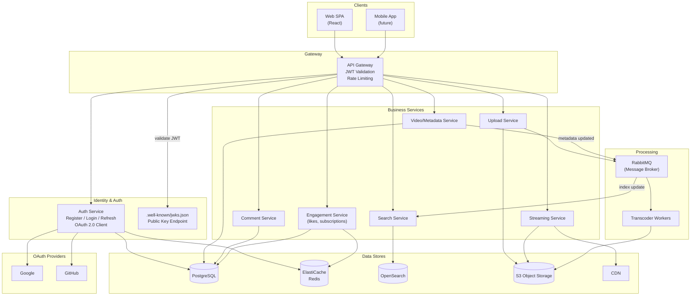

# Task 5 — Architecture Decisions

**Project:** StreamVibe MVP
**Authors:** Mike Ivanov
**Date:** February 2026

---

## Table of Contents

1. [ADR-001: Database Selection](#adr-001-database-selection)
2. [ADR-002: API Type Selection](#adr-002-api-type-selection)
3. [Security: Identity Management](#security-identity-management)
4. [Identity Management Architecture Diagram](#identity-management-architecture-diagram)
5. [Access Control Model](#access-control-model)

---

## ADR-001: Database Selection

| Field | Value |
|-------|-------|
| **Status** | Accepted |
| **Date** | 2026-02-28 |
| **Decision makers** | Mike Ivanov |

### Context

The StreamVibe MVP handles several distinct data workloads:

| Workload | Nature | Scale Characteristics |
|----------|--------|-----------------------|
| **User accounts, channels, subscriptions** | Relational, transactional, strong consistency | Moderate write, heavy read |
| **Video metadata** (title, description, tags, visibility) | Structured, frequently queried | Moderate write, very heavy read |
| **Comments** | Hierarchical (threaded), append-heavy | Heavy write + read |
| **Likes / dislikes** | Simple counters, idempotent per user | Very heavy write (hot-path) |
| **Playlists** | Ordered collections with references | Light write, moderate read |
| **Search index** | Full-text, fuzzy matching on titles/descriptions/tags | Near-real-time indexing, heavy read |
| **Video files & thumbnails** | Large binary blobs (GB-scale) | Write-once, read-many via CDN |
| **Session / hot data cache** | Ephemeral key-value | Extremely high throughput, low latency |

We need a data strategy that covers all of these while remaining cost-effective and operationally simple for an MVP team of 2–4 engineers.

### Decision

We adopt a **polyglot persistence** approach with four storage technologies:

| Technology | Role | Justification |
|------------|------|---------------|
| **Amazon RDS for PostgreSQL 16** | Primary OLTP database | Users, channels, subscriptions, video metadata, comments, playlists, likes |
| **Amazon ElastiCache (Redis 7)** | Cache & real-time counters | Session tokens, view count buffering, hot feed caching, rate-limiting |
| **OpenSearch 2.x** | Full-text search index | Video search by title, description, tags with ranking |
| **Amazon S3** (or S3-compatible) | Object storage | Raw uploads, transcoded video segments (HLS/DASH), thumbnails |

#### Why Amazon RDS for PostgreSQL as the primary database

PostgreSQL gives us ACID transactions (needed for user registration, likes idempotency, playlist ordering), rich querying (`JSONB` for flexible metadata, `CTEs` for threaded comments), and a mature ecosystem with connection pooling and partitioning tools.

We run it as **Amazon RDS** — managed backups, patching, Multi-AZ failover out of the box. Production cost is ~$70/mo (`db.t4g.medium`). Read replicas (up to 5) handle heavy video metadata reads. If we outgrow this, Aurora PostgreSQL is a drop-in upgrade with 5× throughput and no code changes.

#### Alternatives considered

| Alternative | Why rejected |
|-------------|-------------|
| **MySQL** | Lacks `JSONB`, recursive CTEs were added late, weaker extension ecosystem. PostgreSQL is more feature-rich for our use cases. |
| **MongoDB** | Flexible schema is appealing for metadata, but we need cross-entity joins (playlists↔videos, comments↔users) and ACID transactions. MongoDB multi-document transactions add latency and complexity. |
| **CockroachDB / YugabyteDB** | Distributed SQL is over-engineered for MVP scale. Adds operational cost and latency (consensus overhead) without clear benefit at < 100K users. |
| **DynamoDB** | Great for key-value access patterns but poor for ad-hoc queries, search, and relational joins. Would require DynamoDB + another DB, increasing total complexity. |

#### Why ElastiCache (Redis) over Memcached

Redis offers rich data structures (sorted sets for feeds, HyperLogLog for view counts, Lua scripting for atomic rate-limiting) that our application needs beyond simple key-value caching. Memcached only supports plain key-value. ElastiCache as managed service handles patching, failover, and Multi-AZ replication.

#### Why OpenSearch over PostgreSQL full-text search

PostgreSQL `tsvector` works for small datasets but lacks fuzzy matching, autocomplete, and relevance tuning. OpenSearch provides all of these out of the box with horizontal scale-out. Solr is similar but has a smaller managed-service presence on AWS.

#### Why S3 for video storage

Unlimited capacity, 99.999999999% durability, native CloudFront CDN integration for global delivery, and pre-signed URLs for direct browser-to-S3 uploads without going through the backend.

### Data Flow Overview

```
┌────────────┐  writes   ┌───────────────┐  replicates   ┌──────────────┐
│  Services  │──────────▶│  PostgreSQL   │──────────────▶│  Read Replica │
│            │           │  (primary)    │               │  (reads)      │
└────────────┘           └───────────────┘               └──────────────┘
      │                         │
      │  cache-aside            │  CDC / app-level event
      ▼                         ▼
┌────────────┐           ┌───────────────┐
│ElastiCache │           │  OpenSearch   │
│  (Redis)   │           │  (search idx) │
└────────────┘           └───────────────┘

Upload flow:
  Browser ──pre-signed URL──▶ S3 (raw) ──event──▶ RabbitMQ ──▶ Transcoder ──▶ S3 (HLS)
                                                                     │
                                                                     └──▶ CDN Origin
```

### Consequences

**Positive:**
- Single relational database for all transactional data simplifies development, schema migrations, and backups.
- ElastiCache (Redis) offloads hot-path reads, keeping PostgreSQL latency low.
- OpenSearch delivers a responsive search experience without over-indexing in PostgreSQL.
- S3 + CDN is the industry standard for video storage and delivery.

**Negative:**
- Four distinct technologies require operational knowledge (mitigated by managed services).
- Data synchronization between PostgreSQL and OpenSearch must be handled (async events via RabbitMQ — already part of the architecture).
- ElastiCache (Redis) as a cache introduces eventual consistency for cached data (acceptable for feeds and counters; auth tokens are checked against the source of truth).

---

## ADR-002: API Type Selection

| Field | Value |
|-------|-------|
| **Status** | Accepted |
| **Date** | 2026-02-28 |
| **Decision makers** | Mike Ivanov |

### Context

The StreamVibe MVP exposes functionality to two client types:
- **Web SPA** (React) — needs flexible data fetching, mobile-friendly payloads.
- **Mobile App** (future, but must not be blocked) — bandwidth-sensitive, needs efficient data transfer.

Internally, microservices communicate with each other. We need to decide the API strategy for both **external** (client ↔ gateway) and **internal** (service ↔ service) communication.

Key considerations:
- MVP team size is 2–4 engineers; minimize learning curve and tooling overhead.
- Video metadata pages are read-heavy and require aggregated data from multiple services (metadata + user profile + engagement counts + comments).
- Upload and streaming are I/O-heavy but relatively simple in terms of API surface.
- We already chose RabbitMQ for async processing; this decision covers synchronous request/response.

### Decision

| Boundary | Protocol | Justification |
|----------|----------|---------------|
| **Client ↔ API Gateway** | **REST (HTTP/2, JSON)** | Primary external API |
| **Internal service ↔ service** | **REST (HTTP/2, JSON)** | Synchronous internal calls |
| **Real-time** (future) | **WebSocket** | Comment stream, live counters (deferred) |

We choose **REST** over GraphQL and gRPC for both external and internal communication.

#### Why REST for External API

1. **Simplicity** — REST is universally understood. Every frontend framework, mobile SDK, and testing tool has first-class REST support. This minimizes onboarding time for an MVP team.
2. **Caching** — REST's resource-oriented model maps directly to HTTP caching semantics (`ETag`, `Cache-Control`, `304 Not Modified`). Video metadata pages, search results, and feed endpoints benefit from CDN and browser caching out of the box.
3. **Tooling** — OpenAPI/Swagger generates client SDKs, server stubs, and interactive documentation with zero custom tooling.
4. **Predictable payloads** — For the MVP, our UI views are well-defined. Over-fetching is minimal because we can shape endpoint responses to match view requirements (e.g., `/videos/{id}?include=channel,engagement`).
5. **HTTP/2 multiplexing** — Eliminates the head-of-line blocking concern. Multiple concurrent REST calls (metadata + comments + engagement) execute efficiently over a single connection.

#### Why REST for Internal Communication (not gRPC)

1. **Uniformity** — One protocol everywhere means one set of observability tools (request tracing, logging, error codes), one set of middleware patterns, and simpler debugging.
2. **MVP scale does not warrant gRPC** — gRPC's binary serialization (protobuf) offers performance gains at high throughput (>10K RPS per service). Our MVP operates at ~100–1K RPS; the JSON serialization overhead is negligible.
3. **Developer experience** — REST calls can be tested with `curl`, Postman, or a browser. gRPC requires specialized clients (`grpcurl`, BloomRPC) and proto compilation steps.
4. **Migration path** — If a specific internal hot-path (e.g., Auth token validation on every request) becomes a bottleneck, it can be individually migrated to gRPC without affecting the rest of the system.

#### Alternatives considered

| Alternative | Pros | Why rejected for MVP |
|-------------|------|----------------------|
| **GraphQL** | Flexible queries, eliminates over-fetching, single endpoint | Adds complexity (schema stitching across microservices, N+1 query problem, custom caching logic since HTTP caching doesn't apply). Requires dedicated tooling (Apollo Federation or similar). Over-engineered for an MVP with well-known UI views. |
| **gRPC (external)** | High performance, strong typing via protobuf | Poor browser support (requires gRPC-Web proxy), no native caching, terrible developer onboarding experience for frontend engineers. |
| **gRPC (internal)** | Efficient binary serialization, bi-directional streaming, auto-generated clients | Operational overhead of proto management, compilation pipeline, and specialized debugging tools is not justified at MVP scale. |
| **tRPC** | End-to-end type safety for TypeScript stacks | Ties backend to TypeScript/Node; our backend may use Java/Kotlin (Spring Boot) or Go. Not language-agnostic. |

### API Design Principles

| Principle | Implementation |
|-----------|----------------|
| **Resource-oriented URLs** | `/api/v1/videos/{id}`, `/api/v1/channels/{id}/videos` |
| **Standard HTTP methods** | `GET` (read), `POST` (create), `PUT/PATCH` (update), `DELETE` (remove) |
| **Consistent error format** | `{ "error": { "code": "NOT_FOUND", "message": "..." } }` |
| **Pagination** | Cursor-based (`?cursor=abc&limit=20`) for feeds, offset-based for search |
| **Versioning** | URL prefix (`/api/v1/`) for breaking changes |
| **Rate limiting** | `429 Too Many Requests` with `Retry-After` header, enforced at gateway |
| **Idempotency** | `Idempotency-Key` header for `POST` (upload, like/unlike) |

### Consequences

**Positive:**
- One protocol everywhere reduces cognitive load and operational complexity.
- Leverages HTTP caching infrastructure (CDN, reverse proxies) with zero extra effort.
- Maximum tooling ecosystem (OpenAPI, Postman, any HTTP client library).
- Easy to onboard new developers; no proto compilation or schema federation to learn.

**Negative:**
- JSON is less efficient than protobuf (~30–50% larger payloads); acceptable at MVP scale.
- No built-in contract enforcement like protobuf — mitigated by OpenAPI specs and CI validation.
- If the system scales significantly, some internal hot-paths may need migration to gRPC (planned as an incremental optimization, not an upfront cost).

---

## Security: Identity Management

### Selected Option: **Self-managed JWT + OAuth 2.0 (via Auth Service)**

We implement a dedicated **Auth Service** that handles:
- Local credentials (email + password with bcrypt hashing)
- Social login via **OAuth 2.0 / OpenID Connect** (Google, GitHub — most common for MVP)
- Token issuance and validation using **JWT (JSON Web Tokens)**

#### Why this approach

| Factor | Decision rationale |
|--------|-------------------|
| **Cost** | No per-user licensing cost (vs. Auth0 free tier caps at 7,500 MAU, Okta is expensive). For an MVP that may grow rapidly if it gains traction, avoiding vendor lock-in is prudent. |
| **Control** | Full control over token claims, session policies, password rules, and rate limiting. |
| **Simplicity** | JWT is stateless — any service can validate a token locally by checking the signature against the public key, with no round-trip to Auth Service on every request. |
| **Standards-based** | OAuth 2.0 + OIDC for social login is an industry standard with libraries in every language. |
| **Scalability** | Stateless tokens scale horizontally. No session store to shard (ElastiCache/Redis stores refresh tokens and revocation lists only). |

#### Alternatives considered

| Alternative | Why rejected |
|-------------|-------------|
| **Auth0 / Okta (hosted IDaaS)** | Free tier limits are restrictive for a video platform that may have many anonymous-to-registered conversions. Monthly costs scale with MAU and add vendor dependency. Good for enterprise SaaS, overkill for MVP. |
| **Keycloak (self-hosted)** | Full-featured but heavy to operate (Java-based, needs its own database, admin console). Adds significant infrastructure burden for an MVP team. Could be adopted later if advanced features (MFA, federation) are needed. |
| **Firebase Auth** | Easy integration but ties us to Google Cloud ecosystem. Limited customization for token claims and session policies. |
| **Session-based auth (server-side sessions)** | Requires sticky sessions or a shared session store across all services. Does not fit a microservice/stateless architecture. |

### Token Strategy

```
┌─────────────────────────────────────────────────────┐
│                   Token Design                       │
├─────────────────────────────────────────────────────┤
│                                                      │
│  Access Token (JWT)                                  │
│  ├─ Signed with RS256 (asymmetric)                  │
│  ├─ TTL: 15 minutes                                 │
│  ├─ Contains: userId, roles[], channelId            │
│  ├─ Validated locally by any service (public key)   │
│  └─ NOT stored server-side                          │
│                                                      │
│  Refresh Token (opaque)                              │
│  ├─ Stored in Redis (hashed)                        │
│  ├─ TTL: 30 days                                    │
│  ├─ Rotation on each use (old token invalidated)    │
│  ├─ Bound to device/IP fingerprint                  │
│  └─ Used to obtain new access tokens                │
│                                                      │
└─────────────────────────────────────────────────────┘
```

| Property | Access Token | Refresh Token |
|----------|-------------|---------------|
| Format | JWT (signed, RS256) | Opaque random string |
| Lifetime | 15 minutes | 30 days |
| Storage (client) | Memory / `httpOnly` cookie | `httpOnly`, `Secure`, `SameSite=Strict` cookie |
| Storage (server) | None (stateless) | Redis (hashed value) |
| Revocable? | No (short-lived, so expiry is sufficient) | Yes (delete from Redis) |
| Contains PII? | Minimal (userId, roles) | No (opaque) |

### Password Security

- **Hashing:** bcrypt with cost factor 12
- **Minimum requirements:** 8 characters, at least one number and one letter
- **Brute-force protection:** Rate limit login attempts (5 per minute per IP, tracked in Redis)
- **Compromised password check:** Validate against HaveIBeenPwned API (k-anonymity model) on registration

---

## Identity Management Architecture Diagram

The diagram below shows how auth components interact in the MVP:

```
  Client (SPA / Mobile)
       │
       ▼
  ┌──────────────┐     ┌──────────────┐     ┌────────────────┐
  │ API Gateway  │────▶│ Auth Service  │────▶│ PostgreSQL(RDS)│
  │              │     │              │     │  Users, Roles  │
  │ • JWT verify │     │ • Register   │     └────────────────┘
  │ • Rate limit │     │ • Login      │
  │ • Route      │     │ • Refresh    │     ┌────────────────┐
  └──────┬───────┘     │ • OAuth 2.0  │────▶│ ElastiCache    │
         │             └──────────────┘     │ Refresh tokens │
         │                    │             │ Rate limits    │
         │                    ▼             └────────────────┘
         │             ┌──────────────┐
         │             │ Google /     │
         │             │ GitHub OIDC  │
         │             └──────────────┘
         │
         │  (injects X-User-Id, X-User-Roles headers)
         ▼
  ┌──────────────────────────────────────────┐
  │         Downstream Services              │
  │  Video · Search · Comment · Engagement   │
  │  (trust gateway headers, no re-auth)     │
  └──────────────────────────────────────────┘
```

**How it works:**
1. Client sends credentials (or OAuth code) to Auth Service via the API Gateway.
2. Auth Service verifies identity, issues a short-lived **JWT access token** (15 min) + **opaque refresh token** (30 days, stored hashed in ElastiCache).
3. On subsequent requests, the API Gateway validates the JWT signature using the Auth Service's cached public key (no network call) and injects user identity headers.
4. Downstream services trust those headers and perform their own ownership checks where needed.

---

## Access Control Model

We use a simple **Role-Based Access Control (RBAC)** model with three roles. This keeps authorization logic straightforward for the MVP and can be extended to attribute-based access control (ABAC) later if needed.

- **GUEST** — unauthenticated visitor (no token). Can watch videos, search, browse home/channel pages.
- **USER** — registered, authenticated user. Can like/dislike, comment, subscribe, create playlists, upload videos.
- **CREATOR** — a USER who owns a channel (granted automatically on first video upload). Can additionally edit/delete their own videos and channel, pin comments on their videos.

There is no separate "admin" role in the MVP — moderation and admin tooling are out of scope.

Access control is enforced at two layers: the **API Gateway** (coarse-grained — rejects unauthenticated requests to protected routes, injects user identity headers) and at the **service level** (fine-grained — each service verifies resource ownership, e.g., only the video creator can edit/delete their video).

### Permission Matrix

| Resource / Action | GUEST | USER | CREATOR (own content) |
|-------------------|-------|------|----------------------|
| **Watch video** | ✅ | ✅ | ✅ |
| **Search videos** | ✅ | ✅ | ✅ |
| **View home page** | ✅ | ✅ | ✅ |
| **View channel page** | ✅ | ✅ | ✅ |
| **Register / Login** | ✅ | — | — |
| **Like / Dislike video** | ❌ | ✅ | ✅ |
| **Subscribe to channel** | ❌ | ✅ | ✅ |
| **View subscriptions feed** | ❌ | ✅ | ✅ |
| **Add comment** | ❌ | ✅ | ✅ |
| **Edit own comment** | ❌ | ✅ | ✅ |
| **Delete own comment** | ❌ | ✅ | ✅ |
| **Pin comment (on own video)** | ❌ | ❌ | ✅ |
| **Create playlist** | ❌ | ✅ | ✅ |
| **Upload video** | ❌ | ✅ | ✅ |
| **Edit video metadata** | ❌ | ❌ | ✅ (own only) |
| **Delete video** | ❌ | ❌ | ✅ (own only) |

### Security Summary

- **Token theft** — short-lived access tokens (15 min) + HTTPS-only + `httpOnly`/`Secure`/`SameSite=Strict` cookies.
- **Brute-force** — login rate-limited to 5 attempts/min/IP via ElastiCache.
- **Refresh token compromise** — tokens are rotated on every use, stored hashed in ElastiCache, bound to device fingerprint.
- **Privilege escalation** — JWT signed with RS256 (tamper-proof); ownership checks enforced at service level.

---

## Appendix: Mermaid Diagrams (for rendering)

### C4 Level 2 — Container Diagram with Identity Management


